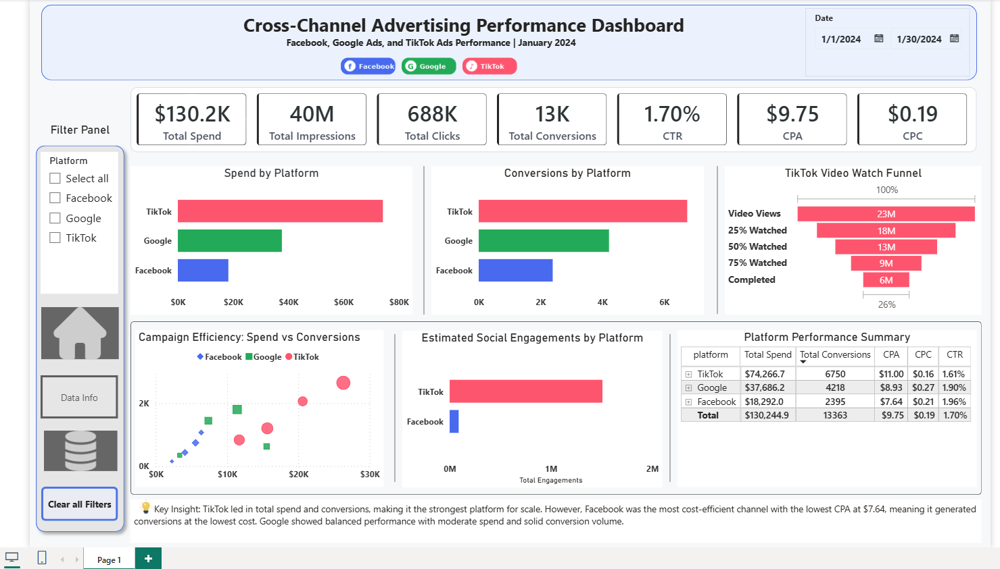

# Improvado_Marketing_Analysis_Project
Cross-channel advertising performance dashboard built with BigQuery, SQL, and Power BI.
# Cross-Channel Advertising Performance Dashboard

## Facebook, Google Ads & TikTok Ads Performance Analysis

## 1. Project Overview

The **Cross-Channel Advertising Performance Dashboard** is an interactive Power BI dashboard built to analyze advertising performance across **Facebook Ads, Google Ads, and TikTok Ads**.

The goal of this project is to create a unified view of multi-channel advertising data and compare platform performance based on spend, impressions, clicks, conversions, cost efficiency, engagement, and video retention.

This dashboard helps marketing teams understand which platform is driving the most conversions, which channel is most cost-efficient, and where future ad budget can be optimized.

---

## 2. Tools and Technologies Used

- **Google BigQuery** – Used as the cloud database to store and transform the raw advertising data.
- **SQL** – Used to combine and standardize Facebook, Google Ads, and TikTok datasets.
- **Power BI Desktop** – Used to build the interactive dashboard and visualizations.
- **DAX** – Used to calculate key performance indicators such as CTR, CPC, CPA, and engagement metrics.
- **Power Query** – Used to connect Power BI with BigQuery and validate the loaded data.
- **CSV Files** – Used as the source data files.

---

## 3. Data Source

The project uses three advertising datasets:

- `01_facebook_ads.csv`
- `02_google_ads.csv`
- `03_tiktok_ads.csv`

Each file contains campaign-level advertising data for January 2024.

The files were uploaded into Google BigQuery as separate raw tables and then combined into one unified table:

```text
marketing-analysis-498500.advertising_data.unified_ads
```

The final unified table contains:

```text
Facebook Ads: 110 rows
Google Ads: 110 rows
TikTok Ads: 110 rows
Total: 330 rows
```

---

## 4. Data Cleaning and Transformation

The original datasets had different column names and platform-specific metrics. To make the data suitable for cross-channel analysis, I created a unified table in BigQuery.

### Main transformation steps:

- Combined all three platform datasets using `UNION ALL`
- Added a `platform` column to identify the source platform
- Standardized common fields such as:
  - Date
  - Campaign ID
  - Campaign Name
  - Group ID
  - Group Name
  - Impressions
  - Clicks
  - Spend
  - Conversions
- Renamed Google and TikTok `cost` fields as `spend`
- Standardized Facebook ad set, Google ad group, and TikTok ad group fields into common group-level columns
- Added date-related fields such as:
  - `day_name`
  - `day_number`
  - `day_label`
  - `week_type`
- Preserved platform-specific fields:
  - Facebook: reach, frequency, engagement rate
  - Google Ads: conversion value, quality score, search impression share
  - TikTok: likes, shares, comments, video views, and video watch completion metrics

Blank values were intentionally kept where a platform did not provide a specific metric. This avoids misleading analysis by not forcing unavailable values to zero.

---

## 5. Business Problem

Marketing teams often run campaigns across multiple platforms, but each platform provides data in a different structure.

This makes it difficult to compare performance across channels and answer questions such as:

- Which platform generated the highest conversions?
- Which platform spent the most budget?
- Which channel had the lowest cost per acquisition?
- Which campaigns were most efficient?
- Which platforms generated the most engagement?
- How well did TikTok video ads retain viewers?

This dashboard solves the problem by combining the data into one unified model and visualizing cross-channel performance in Power BI.

---

## 6. Dashboard Features

### KPI Cards

The dashboard includes high-level KPI cards for:

- Total Spend
- Total Impressions
- Total Clicks
- Total Conversions
- CTR
- CPA
- CPC

These KPIs provide a quick executive summary of overall advertising performance.

---

### Spend by Platform

This chart compares total advertising spend across Facebook, Google Ads, and TikTok.

It helps identify which platform received the largest portion of the advertising budget.

---

### Conversions by Platform

This chart compares total conversions generated by each platform.

It helps identify which platform delivered the highest conversion volume.

---

### Campaign Efficiency: Spend vs. Conversions

A scatter chart compares campaign spend against conversions.

- X-axis: Total Spend
- Y-axis: Total Conversions
- Bubble size: Total Clicks
- Legend: Platform

This helps identify campaigns that generated strong conversions compared to their spend.

---

### Estimated Social Engagements by Platform

This chart compares engagement for platforms where engagement data is available.

- TikTok engagement is calculated using likes, shares, and comments.
- Facebook engagement is estimated using impressions and engagement rate.
- Google Ads is not included in this engagement comparison because comparable social engagement metrics are not available in the dataset.

---

### TikTok Video Watch Funnel

The TikTok video funnel shows video viewer retention across different completion stages:

- Video Views
- 25% Watched
- 50% Watched
- 75% Watched
- Completed

This helps analyze audience drop-off from initial video views to full video completion.

---

### Platform Performance Summary

The summary table compares each platform using:

- Total Spend
- Total Conversions
- CPA
- CPC
- CTR

This provides a compact view of platform-level performance and cost efficiency.

---

## 7. Key DAX Measures

```DAX
Total Spend = SUM(unified_ads[spend])
```

```DAX
Total Impressions = SUM(unified_ads[impressions])
```

```DAX
Total Clicks = SUM(unified_ads[clicks])
```

```DAX
Total Conversions = SUM(unified_ads[conversions])
```

```DAX
CTR = DIVIDE([Total Clicks], [Total Impressions])
```

```DAX
CPC = DIVIDE([Total Spend], [Total Clicks])
```

```DAX
CPA = DIVIDE([Total Spend], [Total Conversions])
```

```DAX
Total Engagements = SUM(unified_ads[engagement_count])
```

---

## 8. Business Insights

### Key Insight

TikTok led in total spend and conversions, making it the strongest platform for scale. However, Facebook was the most cost-efficient channel with the lowest CPA at **$7.64**, meaning it generated conversions at the lowest cost. Google Ads showed balanced performance with moderate spend and solid conversion volume.

### Business Value

- **Budget Optimization:** Helps identify which platform should receive more or less advertising budget.
- **Cost Efficiency Analysis:** CPA and CPC help compare platform efficiency.
- **Campaign Performance Tracking:** The scatter chart highlights efficient and underperforming campaigns.
- **Engagement Analysis:** Social engagement and TikTok video funnel provide insights beyond clicks and conversions.
- **Cross-Channel Decision-Making:** Combines Facebook, Google Ads, and TikTok data into one dashboard for easier analysis.

---

## 9. Outcome

The final dashboard provides a clean and interactive view of cross-channel advertising performance.

It helps stakeholders compare platform performance, analyze campaign efficiency, understand engagement patterns, and make data-driven decisions for future marketing budget allocation.

The project follows the complete analytics workflow:

```text
Raw CSV Files → Google BigQuery → SQL Transformation → Power BI Dashboard → Business Insights
```

---

## 10. Dashboard Screenshot



## Video Walkthrough

[Watch Video Walkthrough](https://drive.google.com/file/d/15IC21nrfiofY8OFjWKrHH2ZDhqQmIb3f/view)
